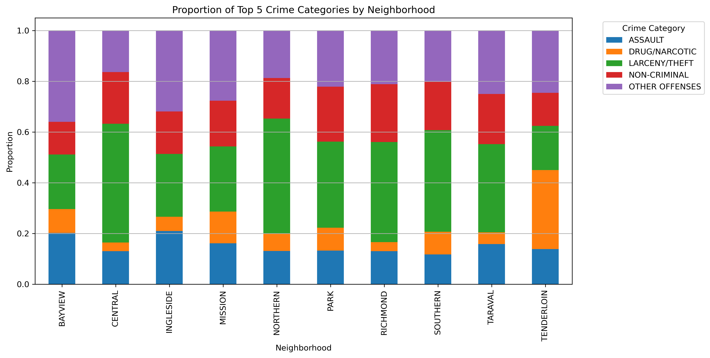
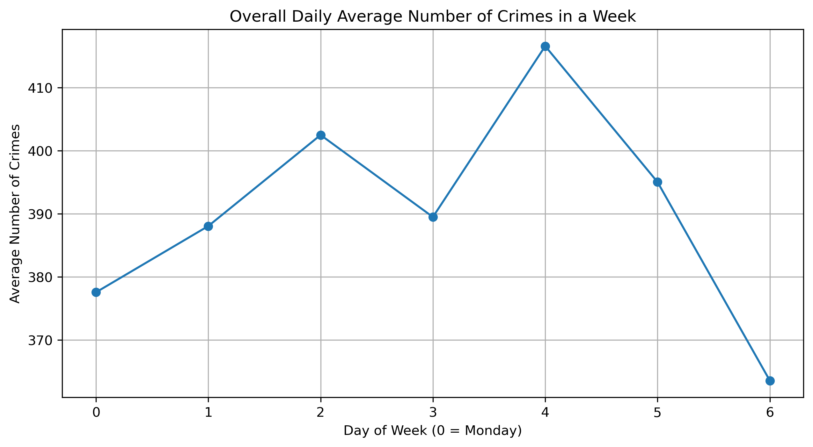
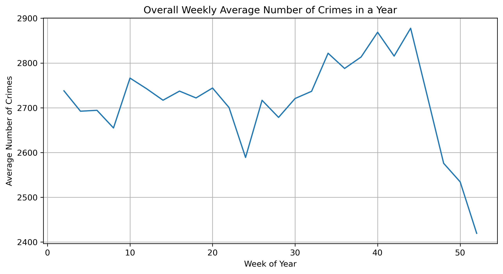
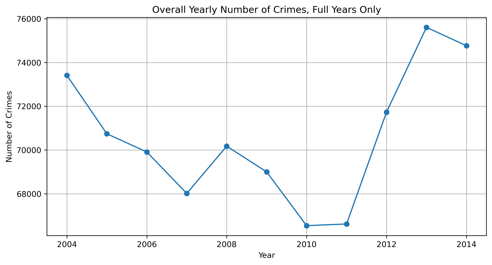
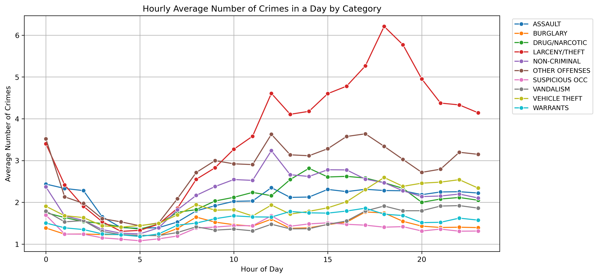
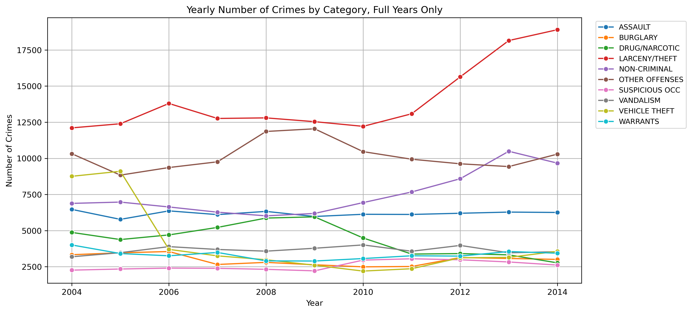
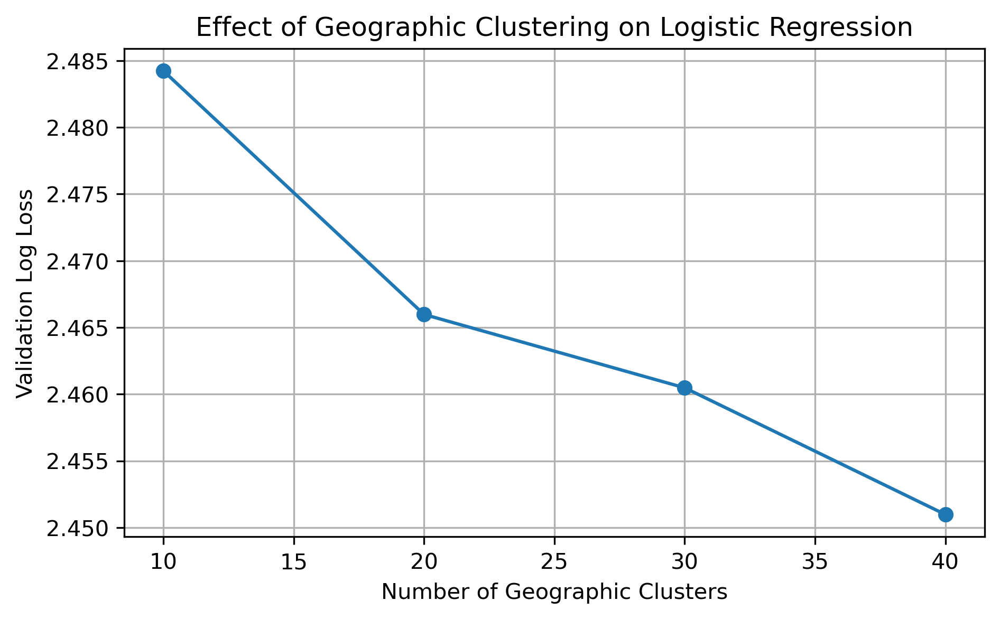
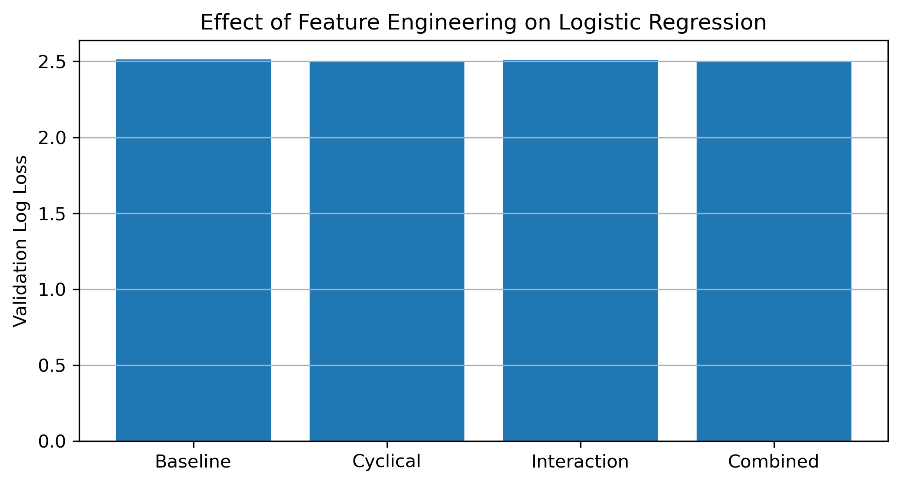
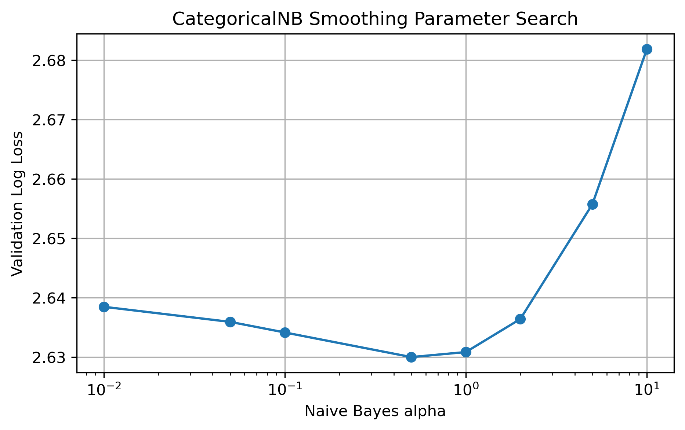

# San Francisco Crime Classification
### Machine Learning Pipeline for Multi-Class Crime Prediction Using Logistic Regression, Random Forest, and XGBoost


---

# Project Overview

This project develops a complete end-to-end machine learning pipeline for multi-class crime classification using the San Francisco Crime Classification dataset.

Rather than treating the project as a single notebook, Version 2 restructures the workflow into a modular, reproducible machine learning project that separates data engineering, feature engineering, experimentation, model training, evaluation, visualization, and reporting.

The primary objective is to predict crime categories from temporal and geographic information while systematically evaluating increasingly sophisticated machine learning models.

The project evolves through several stages:

- Exploratory data analysis
- Feature engineering
- SQL data preparation
- Temporal validation
- Logistic Regression
- Naive Bayes
- Random Forest
- XGBoost optimization
- Explainability with SHAP
- Interactive Tableau dashboards

The final production model is an optimized XGBoost classifier trained using temporal cross-validation and evaluated on a completely frozen hold-out test period.

---

# Repository Highlights (Version 2)

Version 2 transforms the original academic notebook into a reproducible machine learning engineering project by introducing:

✔ Modular Python architecture

✔ DuckDB analytical database

✔ SQL feature engineering pipeline

✔ Config-driven experimentation

✔ Automated experiment tracking

✔ Temporal cross-validation

✔ Frozen hold-out evaluation

✔ XGBoost optimization

✔ SHAP explainability

✔ Interactive Tableau dashboards

✔ Serialized preprocessing pipeline

✔ Saved production model

✔ Reproducible project structure

The project is organized to resemble an industry-style machine learning workflow while remaining lightweight enough to run locally.

---

# Final Model Summary

| Category | Final Choice |
|------------|-------------|
| Algorithm | XGBoost |
| Validation Strategy | Temporal Cross Validation |
| Final Evaluation | Frozen Hold-Out Test Set |
| Explainability | SHAP Values |
| Dashboarding | Tableau |
| Database | DuckDB |
| SQL Layer | Yes |
| Feature Engineering | Modular Pipeline |
| Model Serialization | Joblib |
| Experiment Tracking | Automatic CSV Logging |

The final XGBoost model consistently outperformed Logistic Regression, Naive Bayes, and Random Forest throughout experimentation while maintaining the strongest generalization performance on unseen temporal data.

---

# Repository Structure

```text
sf-crime-classification/
│
├── config/
│   └── config.yaml
│
├── data/
│   ├── raw/
│   ├── database/
│   ├── processed/
│   └── tableau/
│
├── figures/
│   ├── eda/
│   ├── models/
│   ├── evaluation/
│   ├── explainability/
│   └── tableau/
│
├── logs/
│
├── models/
│
├── notebooks/
│
├── report/
│
├── reports/
│   ├── experiments/
│   └── summaries/
│
├── sql/
│
├── src/
│
├── tableau/
│
├── tests/
│
├── README.md
├── requirements.txt
└── pyproject.toml
```

---

# Project Workflow

The overall machine learning workflow follows the pipeline below:

```text
Raw Dataset
      │
      ▼
DuckDB Database
      │
      ▼
SQL Views
      │
      ▼
Feature Engineering
      │
      ▼
Experiment Tracking
      │
      ▼
Model Selection
      │
      ▼
Final XGBoost Training
      │
      ▼
Frozen Test Evaluation
      │
      ▼
Explainability
      │
      ▼
Interactive Dashboards
```

Each stage of the pipeline is modularized into dedicated source files to maximize reproducibility and simplify future experimentation.

# Dataset

This project uses the **San Francisco Crime Classification** dataset originally released through Kaggle.

The dataset contains nearly 880,000 historical crime incidents reported by the San Francisco Police Department and includes temporal, geographic, and categorical information for each event.

Primary fields include:

- Crime category (target variable)
- Date and time
- Police district
- Geographic coordinates
- Address
- Resolution
- Descript

During preprocessing, the raw data are transformed into engineered spatial and temporal features suitable for machine learning.

---

# Large File Notice

Several large artifacts are intentionally excluded from this repository.

GitHub is intended to host source code rather than large datasets or serialized machine learning artifacts. To keep the repository lightweight and reproducible, the following files are omitted:

| Omitted File | Reason |
|--------------|--------|
| `data/raw/san_francisco_crime_train.csv` | Original Kaggle dataset (~122 MB) |
| `data/database/sf_crime.duckdb` | Generated analytical database |
| `models/xgboost_final_model.joblib` | Serialized production model (~170 MB) |

These files can be recreated locally by following the instructions below.

---

# Downloading the Dataset

Download the original dataset from Kaggle:

https://www.kaggle.com/c/sf-crime/data

After downloading, place the training file here:

```text
data/
└── raw/
    └── san_francisco_crime_train.csv
```

No additional preprocessing is required before running the pipeline.

---

# Installation

Clone the repository:

```bash
git clone https://github.com/olveraalec/sf-crime-classification.git

cd sf-crime-classification
```

Create a virtual environment:

```bash
python -m venv .venv
```

Activate the environment.

macOS / Linux

```bash
source .venv/bin/activate
```

Windows

```bash
.venv\Scripts\activate
```

Install project dependencies:

```bash
pip install -r requirements.txt
```

---

# Rebuilding the DuckDB Database

After downloading the dataset, build the analytical database.

```bash
python -m src.build_database
```

This creates

```text
data/database/sf_crime.duckdb
```

The DuckDB database is used throughout the project for SQL-based feature engineering and reproducible analytical queries.

---

# Running the Final Pipeline

Train the final production model:

```bash
python -m src.train_final_model
```

This script automatically performs the following steps:

1. Loads the DuckDB database

2. Constructs engineered features

3. Applies temporal feature transformations

4. Generates interaction features

5. Applies geographic clustering

6. Builds the preprocessing pipeline

7. Trains the optimized XGBoost model

8. Saves the trained artifacts

The following artifacts are generated automatically:

```text
models/

├── xgboost_final_model.joblib
├── xgboost_final_transformer.joblib
├── xgboost_label_encoder.joblib
└── xgboost_final_metadata.json
```

---

# Experiment Outputs

During experimentation, the pipeline automatically records model performance and metadata.

Generated experiment summaries include:

```text
results/

├── experiments/
│
└── summaries/
```

Each experiment stores:

- Hyperparameters
- Validation metrics
- Fold-by-fold performance
- Metadata
- Training time

These outputs make every experiment reproducible and simplify model comparison throughout development.

---

# Tableau Dashboard Files

Version 2 introduces interactive Tableau dashboards summarizing the complete modeling workflow.

The repository includes:

```text
tableau/

└── sf_crime_classification_version_2.twbx
```

Supporting dashboard data are exported to:

```text
data/tableau/
```

Dashboard screenshots used throughout this README are located in:

```text
figures/tableau/
```

---

# Reproducibility

Every stage of the project is deterministic and reproducible.

After downloading the dataset, running

```bash
python -m src.build_database

python -m src.train_final_model
```

will regenerate:

- DuckDB database
- Engineered features
- Final preprocessing pipeline
- Trained XGBoost model
- Model metadata
- Evaluation summaries
- Experiment tracking outputs

without requiring any manual intervention.

# Exploratory Data Analysis

Before developing predictive models, the dataset was analyzed to better understand the temporal, spatial, and categorical structure of crime incidents throughout San Francisco.

The exploratory analysis served two primary purposes:

1. Identify meaningful feature engineering opportunities.
2. Understand long-term temporal and geographic crime patterns.

Rather than immediately fitting machine learning models, the project first examined when and where crimes occurred and how different crime categories behaved over time.

---

# Geographic Crime Density

Understanding the spatial distribution of crime is one of the most important components of this dataset.

The figure below illustrates regions with consistently high crime density across San Francisco.


Several concentrated crime hotspots become immediately visible.

These observations motivated later engineering decisions, including:

- geographic clustering
- latitude and longitude feature utilization
- police district encoding
- neighborhood interaction features

---

# Crime Category Distribution by Neighborhood

Different neighborhoods exhibit very different crime compositions.

Rather than treating all regions identically, this visualization demonstrates that certain categories become much more common within specific geographic areas.



This provided additional motivation for incorporating spatial information directly into the machine learning pipeline.

---

# Overall Crime Trends

Understanding aggregate crime frequency over time provides useful context before examining individual crime categories.

## Hourly Crime Volume



Crime frequency varies substantially throughout the day, indicating that hour-of-day is likely to be an informative predictor.

---

## Daily Crime Volume


Certain days consistently experience higher crime activity than others, motivating categorical encoding of weekday information.

---

## Weekly Crime Volume



Weekly patterns reveal recurring fluctuations that support temporal feature engineering.

---

## Monthly Crime Volume



Monthly seasonality suggests modest long-term variation across the calendar year.

---

## Yearly Crime Volume


Long-term crime frequency remains relatively stable across the observation period, making temporal validation more appropriate than random sampling.

---

# Crime Trends by Category

Aggregate crime counts provide useful context, but each crime category exhibits unique temporal behavior.

Understanding these differences guided feature engineering decisions throughout model development.

---

## Hourly Crime Patterns



Certain crime categories display highly localized hourly peaks while others remain relatively stable throughout the day.

This supports the inclusion of:

- hour
- cyclical hour encoding
- hour interaction features

---

## Daily Crime Patterns


Several crime categories demonstrate strong weekday preferences, suggesting that weekday carries predictive information beyond simple chronological ordering.

---

## Weekly Crime Patterns


Weekly trends reinforce the importance of capturing recurring temporal cycles.

---

## Monthly Crime Patterns


Although seasonal differences are smaller than hourly variation, certain crime categories exhibit noticeable monthly fluctuations.

---

## Yearly Crime Patterns



Long-term stability indicates that model improvements are more likely to come from improved feature engineering than from adapting to large distribution shifts.

---

# Feature Engineering Strategy

The exploratory analysis directly motivated the project's feature engineering pipeline.

Rather than relying solely on the original variables, several additional predictors were constructed.

These include:

- Hour of day
- Day of week
- Month
- Weekend indicator
- Cyclical hour encoding
- Cyclical weekday encoding
- Geographic clusters
- Police district encoding
- Address-derived features
- Spatial interaction terms

These engineered variables formed the foundation of all subsequent machine learning experiments.

---

# Why Exploratory Analysis Matters

Exploratory Data Analysis was not treated as a standalone visualization exercise.

Instead, each visualization informed later engineering decisions.

The progression followed a simple philosophy:

```

Raw Data

↓

Explore Patterns

↓

Engineer Better Features

↓

Train Better Models

↓

Evaluate Performance

```

This iterative workflow became the foundation for every modeling decision throughout the remainder of the project.

# Model Development & Experimentation

One of the primary goals of this project was not simply to build a high-performing classifier, but to understand how increasingly sophisticated machine learning models responded to feature engineering, hyperparameter optimization, and nonlinear representations.

Rather than immediately selecting a complex model, development followed an iterative progression beginning with interpretable linear methods before advancing toward ensemble learning techniques.

The overall modeling workflow followed the progression below:

```text
Logistic Regression
        ↓
Feature Engineering
        ↓
Naive Bayes Benchmark
        ↓
Random Forest
        ↓
XGBoost
        ↓
Final Model Selection
```

Each stage built upon observations from previous experiments, resulting in a systematic model development process rather than isolated hyperparameter searches.

---

# Stage 1 — Logistic Regression

Logistic Regression served as the baseline discriminative classifier.

Although linear, it provided an interpretable foundation for evaluating the effectiveness of engineered spatial and temporal features.

The initial pipeline included:

- One-hot encoded categorical variables
- Standardized continuous variables
- Geographic clustering
- Temporal feature extraction
- Cyclical encodings
- Interaction features

The primary objective was to determine whether careful feature engineering could compensate for the model's linear decision boundary.

---

## Geographic Cluster Optimization

To capture localized crime behavior, latitude and longitude coordinates were grouped into geographic clusters.

The number of clusters was treated as a tunable hyperparameter.



The experiment demonstrated that moderate clustering improved validation performance while excessive clustering introduced unnecessary complexity.

This experiment established geographic clustering as a permanent component of the modeling pipeline.

---

## Feature Engineering Comparison

Several engineered feature combinations were evaluated.

Examples included:

- Geographic interactions
- District-hour interactions
- District-day interactions
- Combined interaction terms
- Targeted nonlinear features



Although interaction terms improved predictive performance, the experiments also revealed diminishing returns as increasingly complex combinations were introduced.

This observation reinforced the importance of carefully balancing model complexity against generalization.

---

## Regularization Parameter Optimization

The inverse regularization parameter (C) was tuned using temporal cross-validation.


Smaller values of C consistently produced stronger generalization performance, indicating that moderate regularization reduced overfitting without sacrificing predictive accuracy.

---

## Logistic Regression Conclusions

Key findings included:

- Geographic information substantially improved predictive performance.
- Temporal variables carried strong predictive signal.
- Cyclical encodings consistently outperformed simple ordinal representations.
- Interaction features produced measurable but diminishing improvements.
- Linear models began reaching their representational limits despite extensive feature engineering.

These observations motivated exploration of nonlinear models.

---

# Stage 2 — Naive Bayes

Naive Bayes served as a lightweight probabilistic benchmark.

Although its conditional independence assumption is unrealistic for crime data, it provides an efficient baseline for comparison.

The model utilized:

- Temporal features
- District information
- Address-derived features

---

## Alpha Parameter Sweep

The smoothing parameter was optimized through grid search.



Performance remained relatively insensitive to alpha, suggesting that feature representation had a greater impact than smoothing.

---

## Feature Set Comparison

Several candidate feature subsets were evaluated.


Unlike Logistic Regression, additional engineered variables produced only modest improvements.

This behavior is consistent with the simplifying assumptions underlying Naive Bayes.

---

## Naive Bayes Conclusions

Although Naive Bayes did not achieve the strongest predictive performance, it provided:

- Extremely fast training
- Strong interpretability
- A valuable probabilistic benchmark

The experiments also confirmed that more expressive nonlinear models would likely be required to capture the complex interactions present within the dataset.

---

# Stage 3 — Random Forest

The next stage introduced nonlinear ensemble learning.

Random Forest removes the linear decision boundary imposed by Logistic Regression and automatically captures high-order feature interactions.

The primary goals were:

- Evaluate nonlinear decision boundaries
- Reduce manual interaction engineering
- Measure performance gains relative to linear models

Several experiments explored:

- Maximum tree depth
- Number of estimators
- Minimum samples per split
- Feature subsampling
- Random seed stability

Random Forest consistently improved predictive performance over both Logistic Regression and Naive Bayes while requiring substantially less manual feature engineering.

However, improvements eventually plateaued, motivating investigation of gradient boosting methods.

---

# Stage 4 — XGBoost

Gradient Boosted Decision Trees became the final modeling approach.

XGBoost combines sequential boosting, regularization, and efficient tree construction to produce state-of-the-art performance on structured tabular datasets.

Compared with previous models, XGBoost offered:

- Better nonlinear representation
- Automatic interaction discovery
- Built-in regularization
- Improved calibration
- Stronger generalization

Multiple rounds of experimentation optimized:

- Learning rate
- Maximum tree depth
- Number of estimators
- Column sampling
- Row sampling
- Minimum child weight
- Regularization parameters

Throughout experimentation, XGBoost consistently achieved the lowest validation log loss while maintaining stable generalization performance across temporal folds.

These experiments ultimately established XGBoost as the production model selected for final evaluation.

---

# Experiment Tracking

Every experiment performed throughout development was automatically recorded.

For each training run, the pipeline logged:

- Model family
- Hyperparameters
- Cross-validation metrics
- Fold statistics
- Training time
- Final validation performance

The resulting experiment summaries enabled direct comparison across Logistic Regression, Naive Bayes, Random Forest, and XGBoost while preserving complete reproducibility.

This experiment tracking framework also simplified later visualization within the Tableau dashboards.

---

# Lessons Learned During Model Development

Several consistent patterns emerged throughout experimentation.

### Feature Engineering

- Spatial information was among the strongest predictive signals.
- Temporal cyclicality improved every model family.
- Interaction features benefited linear models more than tree-based methods.

### Model Complexity

- Logistic Regression provided strong interpretability.
- Random Forest reduced the need for handcrafted interactions.
- XGBoost consistently delivered the strongest predictive performance.

### Engineering Decisions

The progression from linear models to gradient boosting was driven by empirical evidence rather than preference.

Each successive model was only adopted after demonstrating measurable improvements under identical temporal validation procedures.

This iterative experimentation process ultimately produced a robust, reproducible machine learning pipeline suitable for final evaluation.

# Project Evolution and Roadmap

This repository is being developed through a series of increasingly production-oriented versions.

Each version preserves the work completed in the previous stage while introducing a new layer of data science, software engineering, or machine learning capability.

The purpose of this versioned approach is to document the progression from an academic machine learning notebook into a deployable and maintainable machine learning system.

---

## Version 1 — Academic Machine Learning Project

Version 1 established the original analytical and modeling foundation of the project.

The workflow was primarily notebook-based and focused on exploratory analysis, manual feature engineering, and comparison of interpretable probabilistic classification models.

### Version 1 components

- Jupyter Notebook workflow
- Exploratory data analysis
- Temporal trend visualization
- Geographic crime analysis
- Feature engineering
- Geographic clustering
- Logistic Regression
- Naive Bayes
- Hyperparameter sweeps
- Hold-out model evaluation
- Static figures and written report

### Version 1 final result

The optimized Logistic Regression model outperformed Naive Bayes and demonstrated that temporal, district, address, and geographic information could provide meaningful predictive signal.

Version 1 remains available in the repository's dedicated `version-1` branch.

---

## Version 2 — Modular Data Science and Experimentation Pipeline

Version 2 is the current release.

This version preserves the original analysis while restructuring the project into a modular, reproducible machine learning workflow.

The main goal of Version 2 was to move beyond a single notebook and introduce the engineering practices required for systematic experimentation and repeatable model development.

### Version 2 components

- Modular Python source code
- Configuration-driven experiments
- DuckDB analytical database
- Reusable SQL queries and views
- Structured data and artifact directories
- Automated experiment tracking
- Temporal cross-validation
- Frozen temporal test set
- Logistic Regression experiments
- Naive Bayes benchmarks
- Random Forest experiments
- XGBoost optimization
- Final model serialization
- Model metadata generation
- Calibration and reliability analysis
- Per-class model evaluation
- SHAP explainability
- Tableau dashboards
- Reorganized figures and reports
- Reproducible environment configuration

### Version 2 modeling progression

```text
Original Notebook Models
        ↓
Modular Preprocessing
        ↓
SQL and DuckDB Integration
        ↓
Temporal Cross-Validation
        ↓
Automated Experiment Tracking
        ↓
Random Forest Benchmarking
        ↓
XGBoost Optimization
        ↓
Frozen Test Evaluation
        ↓
Explainability and Dashboards
```

### Version 2 final result

The final XGBoost classifier was selected because it produced the strongest balance of:

- Validation log loss
- Frozen test performance
- Predictive accuracy
- Top-k classification performance
- Calibration
- Generalization across temporal folds
- Training efficiency relative to performance
- Compatibility with SHAP-based explainability

Version 2 establishes the data science and experimentation foundation required for future deployment work.

---

## Version 3 — API, Testing, Containerization, and Cloud Deployment

Version 3 will transform the trained model into a deployable inference service.

The primary focus will shift from experimentation toward production-oriented software engineering.

### Planned Version 3 components

#### FastAPI inference service

- Build a REST API around the final prediction pipeline
- Create a `/predict` endpoint
- Validate incoming data with request schemas
- Return predicted crime probabilities
- Include top predicted categories
- Add model and service health endpoints

#### Docker containerization

- Package the API and dependencies inside a Docker image
- Standardize local and cloud execution
- Eliminate environment-specific inconsistencies
- Document image building and container execution

#### Unit and integration testing

- Test feature transformations
- Test input validation
- Test model artifact loading
- Test prediction response structure
- Test API endpoints
- Test failure cases and malformed requests

#### Structured logging

- Replace development print statements with application logging
- Record model loading events
- Record prediction requests
- Record errors and validation failures
- Support separate development and production logging levels

#### Configuration and environment management

- Separate local and deployment configuration
- Introduce environment variables where appropriate
- Avoid hard-coded file paths
- Improve model and artifact path management

#### AWS deployment

- Deploy the Dockerized FastAPI application to AWS
- Initially target an EC2-based deployment
- Expose a remotely accessible prediction endpoint
- Document instance configuration and deployment commands
- Record cloud deployment screenshots and validation results

### Planned Version 3 workflow

```text
Saved Version 2 Model
        ↓
FastAPI Prediction Service
        ↓
Unit and Integration Tests
        ↓
Docker Image
        ↓
Local Container Validation
        ↓
AWS Deployment
        ↓
Remote Prediction Endpoint
```

Version 3 will demonstrate that the model can operate outside the development environment as a reproducible inference service.

---

## Version 4 — PostgreSQL, PyTorch, and Advanced Machine Learning

Version 4 will expand both the data infrastructure and modeling capabilities of the project.

The main objective will be to explore advanced neural-network approaches while replacing the local analytical database with a more production-oriented relational system.

### Planned Version 4 components

#### PostgreSQL data layer

- Replace or supplement DuckDB with PostgreSQL
- Create persistent relational tables
- Develop reusable SQL feature queries
- Practice database indexing and query optimization
- Separate analytical storage from application logic
- Support future API and model-monitoring workflows

DuckDB will remain useful for lightweight local analytics, while PostgreSQL will provide experience with a persistent client-server database architecture.

#### PyTorch classification models

Potential neural-network experiments include:

- Fully connected multiclass classifiers
- Embedding layers for categorical variables
- Learned representations for districts and addresses
- Regularization and dropout
- Batch normalization
- Learning-rate scheduling
- Early stopping
- Class-weighted training
- Hyperparameter and architecture comparisons

#### Hybrid neural-network feature extraction

One planned experiment will combine neural networks with traditional classifiers.

The proposed workflow is:

1. Train a PyTorch neural network.
2. Extract activations from the final hidden layer.
3. Treat the learned representation as a new engineered feature space.
4. Train Logistic Regression, softmax regression, or another classifier on those features.
5. Compare the hybrid pipeline against pure neural-network and XGBoost models.

This approach will test whether a neural network can automatically learn nonlinear interactions that improve a simpler downstream classifier.

#### Advanced experiment management

Version 4 may expand the current experiment-tracking system to include:

- Centralized experiment metadata
- Model artifact versioning
- Training-history storage
- Neural-network learning curves
- Reproducible random seeds
- Architecture comparison tables
- Automated model-selection summaries

#### Model monitoring

Potential monitoring additions include:

- Prediction confidence tracking
- Class-distribution monitoring
- Feature-distribution drift
- API error monitoring
- Inference latency measurement
- Model version tracking

#### Continuous integration and deployment

Potential engineering improvements include:

- Automated test execution
- Code-quality checks
- Docker build validation
- GitHub Actions workflows
- Automated deployment validation
- Release tagging and version documentation

### Planned Version 4 workflow

```text
PostgreSQL Data Layer
        ↓
Reusable SQL Feature Pipeline
        ↓
PyTorch Model Development
        ↓
Neural Representation Learning
        ↓
Hybrid Model Experiments
        ↓
Model Monitoring
        ↓
CI/CD and Deployment Improvements
```

---

# Long-Term Project Direction

The long-term goal is to evolve this repository across four clear stages:

| Version | Primary Focus | Main Outcome |
|---|---|---|
| Version 1 | Academic modeling | Notebook-based crime classification |
| Version 2 | Data science engineering | Modular experimentation and final XGBoost model |
| Version 3 | Production deployment | Tested FastAPI service deployed with Docker and AWS |
| Version 4 | Advanced ML engineering | PostgreSQL, PyTorch, monitoring, and improved deployment workflows |

This roadmap allows each new version to build on the previous implementation instead of replacing it.

The repository therefore documents not only the final model, but also the development process required to move from exploratory data science toward machine learning engineering.

---

# Technologies Used

## Programming Languages

- Python
- SQL

## Machine Learning

- Scikit-learn
- XGBoost
- SHAP

## Data Engineering

- DuckDB
- Pandas
- NumPy

## Data Visualization

- Matplotlib
- Tableau

## Development Tools

- Jupyter Notebook
- VS Code
- Git
- GitHub

---

# Author

## Alec Olvera

B.S. Applied and Computational Mathematics  
University of Southern California (USC)

This repository documents my progression from an academic machine learning project toward production-oriented machine learning engineering. Each version expands upon the previous implementation by introducing more advanced data engineering, software engineering, and deployment practices while preserving reproducibility and transparency throughout the development process.

My interests include:

- Machine Learning Engineering
- Applied Machine Learning
- Data Science
- MLOps
- Software Engineering
- Data Engineering
- Predictive Modeling
- Optimization

### GitHub

https://github.com/olveraalec

---

## Acknowledgments

This project was originally developed using the **San Francisco Crime Classification** dataset provided through Kaggle.

Special thanks to the open-source Python ecosystem, including the developers and maintainers of:

- Scikit-learn
- XGBoost
- DuckDB
- Pandas
- NumPy
- Matplotlib
- SHAP
- Tableau Public

whose tools made this project possible.

---

## License

This project is released under the MIT License.

See the `LICENSE` file for additional details.