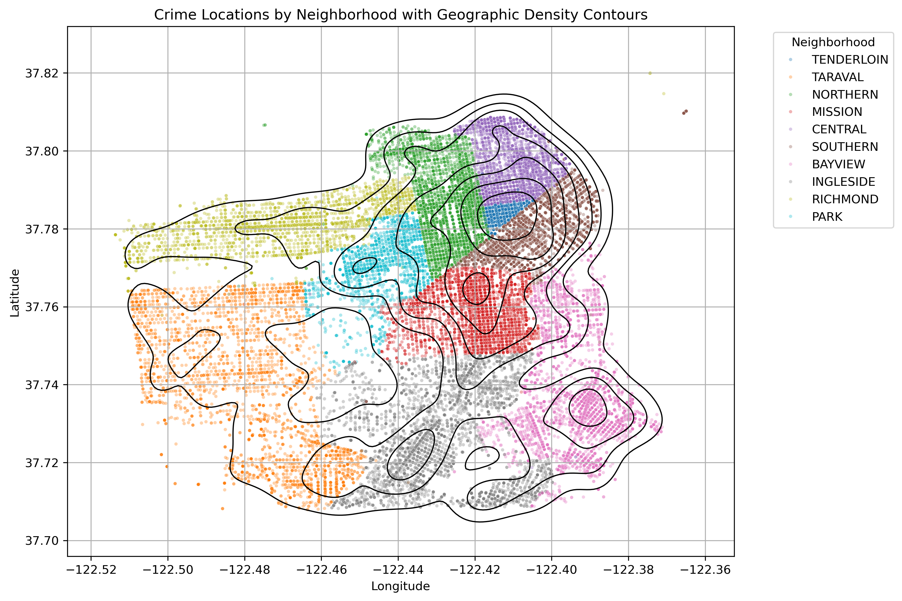
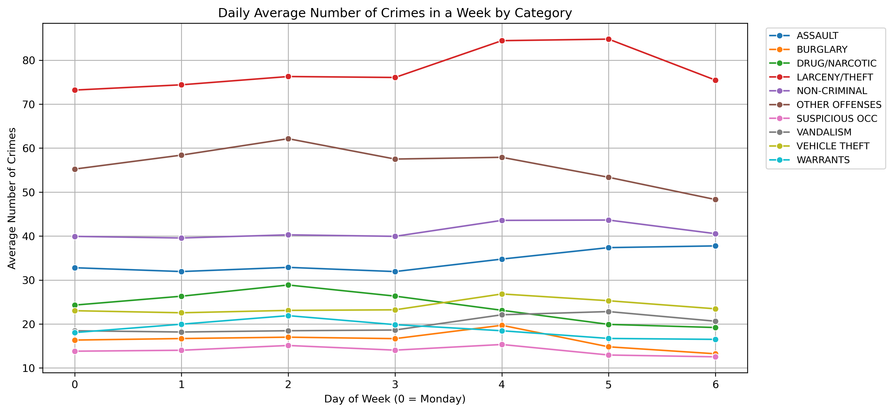
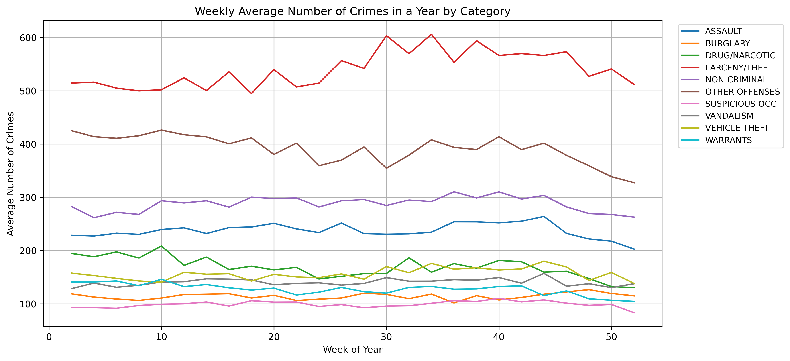
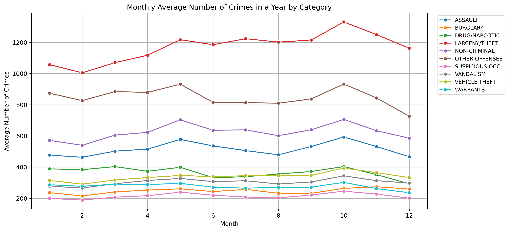
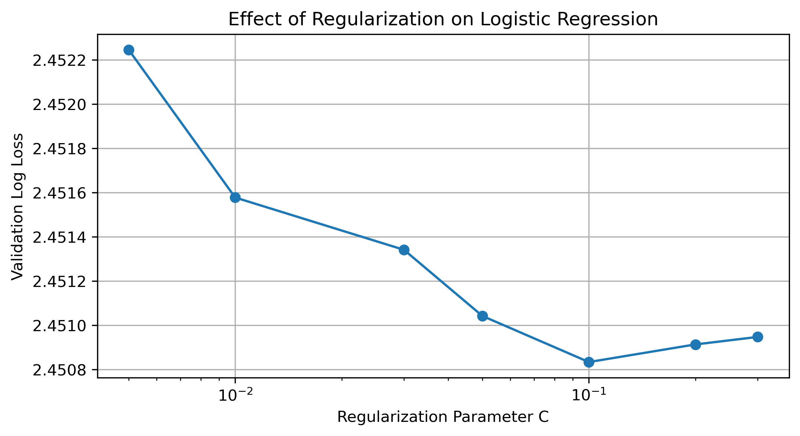
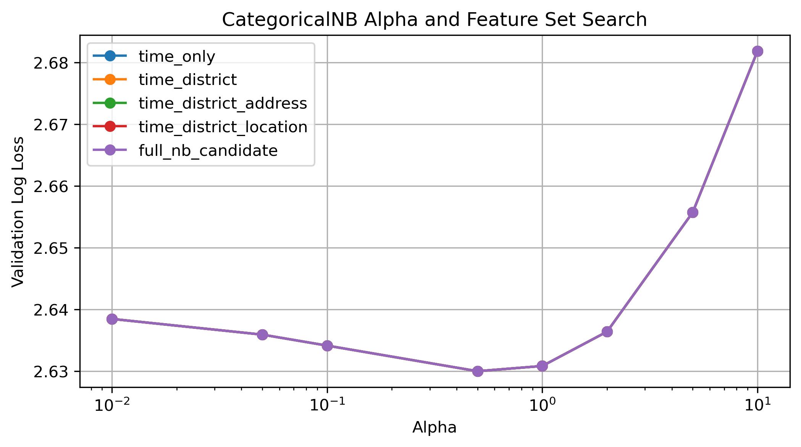

# SF Crime Classification Using Logistic Regression and Naive Bayes

## Project Overview

This project analyzes and classifies crime categories in San Francisco using machine learning techniques, feature engineering, temporal analysis, and geographic clustering.

The primary objective is to predict crime category labels from spatial and temporal information while comparing interpretable probabilistic models against heavily engineered linear classification models.

The workflow includes:

- Data cleaning and preprocessing
- Feature engineering
- Geographic clustering
- Interaction term construction
- Hyperparameter tuning
- Temporal visualization and exploratory analysis
- Logistic Regression modeling
- Naive Bayes modeling
- Final model evaluation

---

# Dataset

Dataset file:

```text
san_francisco_crime_train.csv
```

The dataset contains crime incidents in San Francisco with features including:

- Date and time
- Police district
- Geographic coordinates
- Address information
- Crime category labels

Primary engineered features include:

- Hour of day
- Day of week
- Month
- Geographic clusters
- Interaction terms
- Cyclical encodings

---

# Repository Structure

```text
sf-crime-classification/
│
├── data/
│   └── san_francisco_crime_train.csv
│
├── figures/
│   ├── logistic_geo_cluster_sweep.png
│   ├── logistic_feature_engineering_comparison.png
│   ├── logistic_c_parameter_sweep.png
│   ├── naive_bayes_alpha_sweep.png
│   ├── naive_bayes_feature_set_search.png
│   ├── hourly_crime_trends_by_category.png
│   ├── daily_crime_trends_by_category.png
│   ├── weekly_crime_trends_by_category.png
│   ├── monthly_crime_trends_by_category.png
│   ├── yearly_crime_trends_by_category.png
│   ├── overall_hourly_crime_trend.png
│   ├── overall_daily_crime_trend.png
│   ├── overall_weekly_crime_trend.png
│   ├── overall_monthly_crime_trend.png
│   ├── overall_yearly_crime_trend.png
│   ├── crime_density_contour_map.png
│   └── crime_category_distribution_by_neighborhood.png
│
├── report/
│   └── sf_crime_classification_report.pdf
│
├── sf_crime_classification.ipynb
├── requirements.txt
└── README.md
```

---

# Methods

## 1. Logistic Regression Pipeline

The logistic regression model used:

- One-hot encoding
- Standardization
- Geographic clustering
- Cyclical temporal encoding
- Interaction feature engineering
- Hyperparameter tuning

---

## Logistic Regression Feature Engineering Experiments

| Experiment | Validation Log Loss | Validation Accuracy |
|---|---|---|
| district_hour | 2.465620 | 0.255190 |
| geo_only | 2.465976 | 0.253762 |
| geo_day | 2.470145 | 0.254309 |
| geo_hour | 2.481821 | 0.255926 |
| geo_hour_geo_day | 2.484020 | 0.256488 |
| all_targeted_interactions | 2.494337 | 0.256147 |

---

## Logistic Regression C Parameter Sweep

| C Value | Validation Log Loss | Validation Accuracy |
|---|---|---|
| 0.1 | 2.450834 | 0.258007 |
| 0.2 | 2.450913 | 0.258068 |
| 0.3 | 2.450947 | 0.258022 |
| 0.05 | 2.451042 | 0.257817 |
| 0.03 | 2.451341 | 0.257513 |
| 0.01 | 2.451578 | 0.257529 |
| 0.005 | 2.452245 | 0.257574 |

---

## Cyclical Encoding Experiment

| Experiment | Validation Log Loss | Validation Accuracy |
|---|---|---|
| cyclical_on | 2.450981 | 0.258128 |
| cyclical_off | 2.465400 | 0.256572 |

---

# 2. Naive Bayes Pipeline

The Naive Bayes model focused on lightweight interpretable feature sets:

- Temporal features
- District information
- Address-derived features

---

## Naive Bayes Alpha Sweep

| Alpha | Validation Log Loss | Validation Accuracy |
|---|---|---|
| 0.5 | 2.630014 | 0.237475 |
| 1.0 | 2.630857 | 0.239176 |
| 0.1 | 2.634159 | 0.235372 |

---

## Naive Bayes Feature Set Search

| Feature Set | Alpha | Validation Log Loss | Validation Accuracy |
|---|---|---|---|
| time_only | 0.5 | 2.630014 | 0.237475 |
| time_district | 0.5 | 2.630014 | 0.237475 |
| time_district_location | 0.5 | 2.630014 | 0.237475 |
| time_district_address | 0.5 | 2.630014 | 0.237475 |
| full_nb_candidate | 0.5 | 2.630014 | 0.237475 |

---

# Final Model Comparison

| Model | Test Log Loss | Test Accuracy | Number of Predictors |
|---|---|---|---|
| Optimized Logistic Regression | 2.463315 | 0.249857 | 81 |
| Optimized Naive Bayes | 2.625005 | 0.236819 | 16 |

The optimized logistic regression model achieved the strongest overall performance.

---

# Exploratory Data Analysis

## Geographic Crime Density



---

## Crime Category Distribution by Neighborhood


---

## Hourly Crime Trends by Category


---

## Daily Crime Trends by Category



---

## Weekly Crime Trends by Category



---

## Monthly Crime Trends by Category



---

## Yearly Crime Trends by Category


---

# Hyperparameter and Feature Engineering Results

## Geographic Cluster Sweep


---

## Logistic Regression Feature Engineering Comparison


---

## Logistic Regression C Parameter Sweep



---

## Naive Bayes Alpha Sweep


---

## Naive Bayes Feature Set Search



---

# Future Improvements

Several future directions could significantly improve model performance and expand the project.

## Logistic Regression Improvements

- Further tuning of the regularization parameter C
- Additional geographic clustering experiments
- Reducing dimensionality and multicollinearity
- Refining interaction feature construction
- Exploring alternative logistic regression formulations

---

## Neural Network Extensions

Because crime behavior patterns are highly nonlinear, neural networks may capture more complex spatial-temporal relationships.

Potential future approaches include:

### Pure Neural Network Models

- Fully connected neural network classifiers
- Hyperparameter optimization
- Architecture tuning
- Regularization and dropout experiments

---

### Hybrid Neural Network + Logistic Regression Models

One proposed approach is:

1. Train a neural network
2. Extract functions from the final hidden layer
3. Use those learned nonlinear representations as engineered features
4. Feed those features into logistic regression or softmax classifiers

This approach may effectively create learned interaction terms and nonlinear basis expansions automatically.

---

# Technologies Used

- Python
- NumPy
- Pandas
- Matplotlib
- Seaborn
- Scikit-learn
- Jupyter Notebook

---

# Installation

Clone the repository:

```bash
git clone https://github.com/olveraalec/sf-crime-classification.git
```

Install dependencies:

```bash
pip install -r requirements.txt
```

Run the notebook:

```bash
jupyter notebook
```

---

# Author

Alec Olvera

USC — Applied and Computational Mathematics