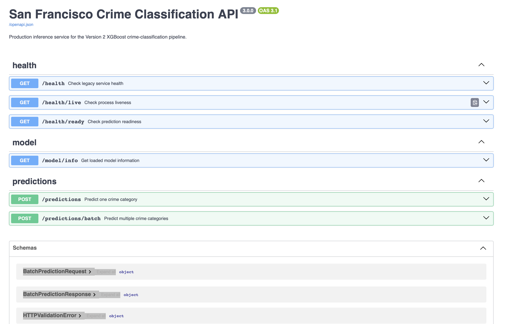
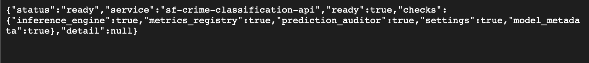
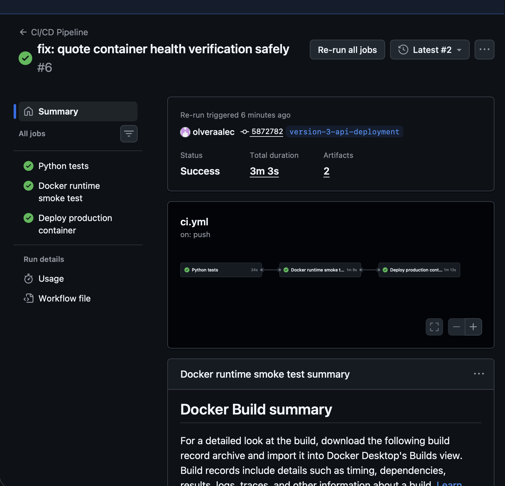
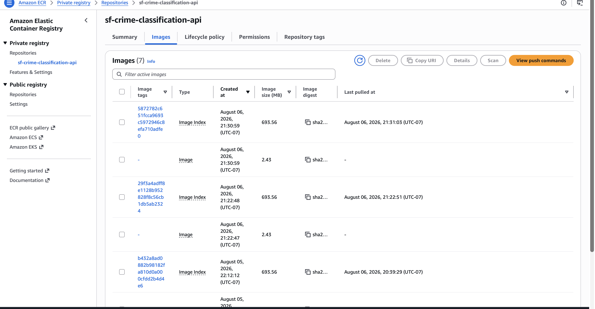

# San Francisco Crime Classification

An end-to-end machine learning system for predicting San Francisco crime categories from temporal, geographic, district, and address information.

The project began as an academic comparison of Logistic Regression and Naive Bayes and was progressively rebuilt into a production-oriented ML system incorporating:

- Reproducible experiment infrastructure
- Temporal cross-validation
- Logistic Regression
- Naive Bayes
- Random Forest
- XGBoost optimization
- Model calibration and evaluation
- SHAP explainability
- DuckDB-based analytical storage
- Interactive Tableau dashboards
- Modular Python architecture
- FastAPI inference services
- Unit and integration testing
- Structured logging and prediction auditing
- Docker containerization
- Amazon ECR image storage
- Amazon EC2 deployment
- AWS Systems Manager deployment orchestration
- Nginx reverse proxying
- HTTPS
- GitHub Actions CI/CD
- Immutable production image deployment

The final production model is an optimized XGBoost classifier trained using temporal cross-validation and evaluated against a completely frozen test set.

Version 3 extends the modeling system developed in Version 2 into a deployable ML service with automated testing, containerization, cloud infrastructure, health monitoring, and CI/CD.

---

## Table of Contents

- [Project Overview](#project-overview)
- [Project Evolution](#project-evolution)
- [Dataset](#dataset)
- [Problem Definition](#problem-definition)
- [System Architecture](#system-architecture)
- [Version 2: Modeling and Experimentation](#version-2-modeling-and-experimentation)
- [Feature Engineering](#feature-engineering)
- [Experiment Framework](#experiment-framework)
- [Model Development](#model-development)
- [Final XGBoost Model](#final-xgboost-model)
- [Model Evaluation](#model-evaluation)
- [Explainability](#explainability)
- [DuckDB Data Layer](#duckdb-data-layer)
- [Tableau Dashboards](#tableau-dashboards)
- [Version 3: Production ML Engineering](#version-3-production-ml-engineering)
- [FastAPI Inference Service](#fastapi-inference-service)
- [API Endpoints](#api-endpoints)
- [Production Health Checks](#production-health-checks)
- [Testing Strategy](#testing-strategy)
- [Structured Logging and Prediction Auditing](#structured-logging-and-prediction-auditing)
- [Docker Containerization](#docker-containerization)
- [AWS Deployment Architecture](#aws-deployment-architecture)
- [CI/CD Pipeline](#cicd-pipeline)
- [Immutable Production Images](#immutable-production-images)
- [Production Deployment Verification](#production-deployment-verification)
- [Repository Structure](#repository-structure)
- [Local Development](#local-development)
- [Technology Stack](#technology-stack)
- [Engineering Lessons](#engineering-lessons)
- [Version 4 Roadmap](#version-4-roadmap)
- [Author](#author)

---

# Project Overview

The objective of this project is to predict the category of a reported San Francisco crime using information available at incident time.

The project intentionally evolved through several stages.

The original implementation focused primarily on statistical modeling. Version 2 rebuilt the project around reproducible experimentation, richer feature engineering, stronger validation, tree-based models, model explainability, analytical storage, and visualization.

Version 3 then addressed a different question:

> How do you turn a trained machine learning model into a reliable, testable, deployable software service?

The resulting repository therefore covers much of the ML lifecycle:

```text
Raw Data
   │
   ▼
DuckDB / Data Preparation
   │
   ▼
Feature Engineering
   │
   ▼
Experiment Framework
   │
   ├── Logistic Regression
   ├── Naive Bayes
   ├── Random Forest
   └── XGBoost
          │
          ▼
Temporal Cross-Validation
          │
          ▼
Frozen Test Evaluation
          │
          ▼
Model Artifact + Metadata
          │
          ▼
FastAPI Inference Service
          │
          ▼
Docker Container
          │
          ▼
Amazon ECR
          │
          ▼
Amazon EC2
          │
          ▼
Nginx / HTTPS
          │
          ▼
Production API
```

The project emphasizes both **model quality** and **software reliability**.

---

# Project Evolution

## Version 1 — Academic Baseline

The original project was developed as a classification analysis comparing:

- Logistic Regression
- Multinomial Naive Bayes

Initial feature engineering included:

- Date/time decomposition
- Police district information
- Address information
- Geographic coordinates
- K-means geographic clusters
- Cyclical time encodings

The primary evaluation metric was multiclass log loss.

Version 1 established the modeling problem but remained primarily notebook-driven.

---

## Version 2 — Reproducible ML System

Version 2 rebuilt the project around a modular experiment framework.

Major additions included:

- Modular Python source code
- Configuration-driven experiments
- Reproducible experiment tracking
- Temporal cross-validation
- Expanded feature engineering
- Logistic Regression optimization
- Naive Bayes optimization
- Random Forest experiments
- XGBoost optimization
- Frozen test-set evaluation
- Calibration analysis
- SHAP explainability
- DuckDB integration
- Tableau dashboards
- Saved experiment metadata and summaries
- Final production model artifacts

Version 2 shifted the project from exploratory modeling toward a reproducible ML workflow.

---

## Version 3 — API, Cloud Deployment, and CI/CD

Version 3 transforms the Version 2 modeling pipeline into a production-oriented inference system.

Major additions include:

- FastAPI application architecture
- Single and batch prediction APIs
- Model metadata API
- Liveness and readiness probes
- Dependency injection
- Centralized exception handling
- Request middleware
- Structured logging
- Prediction auditing
- Unit tests
- Integration tests
- Docker
- Amazon ECR
- Amazon EC2
- AWS Systems Manager
- Nginx
- HTTPS
- GitHub Actions CI/CD
- Automated production deployment
- Immutable image tags
- Post-deployment verification

The modeling logic from Version 2 remains the foundation of the production service rather than being replaced by a separate inference implementation.

---

# Dataset

The project uses the San Francisco crime classification dataset.

Each incident contains information including:

- Timestamp
- Police district
- Address
- Longitude
- Latitude
- Crime category

The target is a multiclass categorical variable representing the reported crime type.

Because the objective is probabilistic classification, models are evaluated primarily using **multiclass log loss** rather than simple classification accuracy.

Log loss penalizes models not only for incorrect predictions but also for assigning excessive confidence to incorrect classes.

This makes probability quality an important component of the modeling process.

---

# Problem Definition

Given an incident containing:

```text
incident timestamp
police district
address
longitude
latitude
```

the system produces:

```text
predicted crime category
predicted probability
ranked alternative predictions
inference latency
```

The production service supports both individual and batch inference.

---

# System Architecture

The final Version 3 architecture separates modeling, inference, API behavior, and infrastructure responsibilities.

```text
                       GitHub
                          │
                          │ Push
                          ▼
                  GitHub Actions
                          │
             ┌────────────┴────────────┐
             │                         │
             ▼                         ▼
        Test / Validate           Docker Build
                                       │
                                       ▼
                                  Amazon ECR
                                       │
                                       │ immutable image
                                       ▼
                              AWS Systems Manager
                                       │
                                       ▼
                                  Amazon EC2
                                       │
                                       ▼
                              Docker Container
                                       │
                                  127.0.0.1:8000
                                       │
                                       ▼
                                     Nginx
                                       │
                                      HTTPS
                                       │
                                       ▼
                                  Public API
```

The application itself is structured approximately as:

```text
HTTP Request
     │
     ▼
FastAPI Route
     │
     ▼
Request Validation
     │
     ▼
Dependency Injection
     │
     ▼
Inference Engine
     │
     ▼
Feature Transformation
     │
     ▼
XGBoost Model
     │
     ▼
Probability Ranking
     │
     ├── Response
     │
     └── Prediction Audit
```

---

# Version 2: Modeling and Experimentation

## Feature Engineering

Feature engineering was treated as an experimental question rather than assuming that additional features automatically improve model performance.

Feature groups explored included:

### Temporal Features

Examples include:

- Hour
- Day
- Month
- Day of week
- Weekend indicators
- Cyclical time encodings

Cyclical encoding allows periodic variables such as hour-of-day to preserve their circular structure.

For example:

```text
23:00 and 00:00
```

should be represented as temporally close rather than numerically far apart.

---

### Geographic Features

Geospatial experiments included:

- Raw latitude and longitude
- Geographic clustering
- Cluster-distance features
- Multiple cluster resolutions
- Alternative geographic representations

These experiments tested whether discretized or distance-based spatial representations improved predictive performance over raw coordinates.

---

### Address Features

Address information was transformed into model-compatible features to capture patterns associated with specific location types and recurring crime environments.

---

### Interaction Features

Selected feature interactions were evaluated to determine whether combinations of temporal, spatial, and categorical information added useful signal.

Importantly, engineered features were retained based on empirical validation rather than complexity alone.

---

# Experiment Framework

A major Version 2 objective was making experiments repeatable.

Experiment configuration was separated from execution logic so that changes to:

- Model type
- Feature groups
- Encoding strategy
- Hyperparameters
- Validation settings

could be evaluated consistently.

Experiment outputs are stored under:

```text
results/
├── experiments/
└── summaries/
```

Individual experiments produce machine-readable artifacts such as:

```text
*_folds.csv
*_metadata.json
*_summary.csv
```

This creates an auditable record of model development rather than relying on notebook output or manually recorded results.

---

# Model Development

Several model families were evaluated.

## Logistic Regression

Logistic Regression provided a strong interpretable baseline and was used extensively during feature engineering.

Experiments included:

- Baseline feature sets
- Address features
- Cyclical features
- Interaction features
- Geographic representations
- Regularization parameter sweeps
- Convergence testing

Because Logistic Regression responds predictably to feature changes, it was particularly useful for measuring whether engineered features actually contributed useful signal.

---

## Naive Bayes

Multinomial Naive Bayes served as a computationally efficient probabilistic baseline.

Experiments included:

- Alpha sweeps
- Feature selection variants
- Model comparisons against Logistic Regression

---

## Random Forest

Random Forest introduced nonlinear modeling capacity and allowed evaluation of tree-based relationships among geographic, temporal, and categorical predictors.

Hyperparameter experiments explored tree depth, leaf size, and related model complexity controls.

---

## XGBoost

XGBoost ultimately provided the strongest production candidate.

Optimization included experiments across parameters such as:

- Tree depth
- Child-weight constraints
- Learning rate
- Number of trees
- Subsampling
- Column sampling
- Gamma
- L1 regularization
- L2 regularization

The final model was selected through validation performance rather than evaluation on the frozen test set.

---

# Final XGBoost Model

The final production classifier is an optimized XGBoost model.

The training process separates:

```text
Model Development
        │
        ▼
Temporal Cross-Validation
        │
        ▼
Hyperparameter Selection
        │
        ▼
Final Training
        │
        ▼
Frozen Test Evaluation
```

The frozen test set remains isolated during model development.

This reduces the risk of indirectly tuning the system to its final evaluation data.

The resulting model artifact is accompanied by metadata describing the trained production model.

Production artifacts are stored under:

```text
artifacts/models/
```

with metadata and integrity information maintained alongside the model.

---

# Model Evaluation

Evaluation extends beyond a single classification metric.

The project includes analysis of:

- Multiclass log loss
- Per-class F1
- Confusion matrices
- Prediction confidence
- Calibration
- Reliability
- Class-level performance

Evaluation figures are stored under:

```text
figures/evaluation/
```

including outputs such as:

```text
xgboost_confidence_histogram.png
xgboost_confusion_matrix_all_classes.png
xgboost_confusion_matrix_top_classes.png
xgboost_per_class_f1.png
xgboost_reliability_diagram.png
```

This is particularly important for probabilistic models because a useful classifier should produce meaningful probability estimates rather than simply maximize top-1 accuracy.

---

# Explainability

SHAP analysis is used to investigate the final XGBoost model.

Explainability outputs include:

- Global feature importance
- Gain-based importance
- Weight-based importance
- Class-specific SHAP analysis

Example artifacts include:

```text
figures/explainability/
├── shap_global_bar.png
├── shap_larceny_theft.png
├── xgb_importance_cover.png
├── xgb_importance_gain.png
└── xgb_importance_weight.png
```

These analyses provide insight into both overall model behavior and individual crime-category decision patterns.

---

# DuckDB Data Layer

Version 2 introduced DuckDB as the project's analytical database.

The database layer separates raw data from cleaned and model-ready representations.

SQL scripts include:

```text
sql/
├── 01_create_raw_table.sql
├── 02_create_clean_view.sql
├── 03_create_feature_view.sql
└── 04_create_modeling_view.sql
```

This provides a reproducible progression from raw source data to modeling-ready data.

DuckDB was selected because it provides SQL-based analytical workflows while remaining lightweight and easily reproducible locally.

The database is stored under:

```text
data/database/
```

---

# Tableau Dashboards

Version 2 also includes interactive Tableau visualization.

The dashboard covers three major areas:

### Exploratory Analysis

Geographic, temporal, and categorical patterns in San Francisco crime.

### Final Model Evaluation

Performance and behavior of the selected production model.

### Experiment Tracking

Comparison of model experiments and tuning results.

Dashboard images are available under:

```text
figures/tableau/
```

and the Tableau workbook is stored under:

```text
tableau/
```

---

# Version 3: Production ML Engineering

Version 3 focuses on the engineering required to expose the final model as a reliable service.

The production architecture separates:

- API routes
- Request/response schemas
- Inference
- Artifact loading
- Configuration
- Logging
- Prediction auditing
- Metrics
- Exception handling

rather than placing all production logic inside a single application file.

---

# FastAPI Inference Service

FastAPI provides the HTTP interface to the trained model.

API code is organized under:

```text
src/api/
├── app.py
├── dependencies.py
├── exception_handlers.py
├── middleware.py
├── schemas.py
└── routes/
```

This separates transport-layer concerns from the underlying inference engine.

The API includes:

- Typed request schemas
- Typed response schemas
- Dependency injection
- Centralized exception handling
- Request middleware
- Automatic OpenAPI documentation
- Liveness/readiness endpoints
- Single prediction
- Batch prediction
- Model metadata

---

# API Endpoints

## Health

```http
GET /health
```

Maintains the original Version 3 health contract for backward compatibility.

---

## Liveness

```http
GET /health/live
```

Confirms that the FastAPI process is alive and capable of receiving requests.

Liveness intentionally does **not** require all model dependencies to be healthy.

---

## Readiness

```http
GET /health/ready
```

Determines whether the application is ready to receive prediction traffic.

Readiness validates critical dependencies including:

```text
inference_engine
metrics_registry
prediction_auditor
settings
model_metadata
```

If required components are unavailable, the endpoint returns a non-ready response rather than falsely reporting the service as healthy.

---

## Model Information

```http
GET /model/info
```

Returns selected metadata for the currently loaded production model, including information such as:

- Model name
- Algorithm
- Training timestamp
- Number of classes
- Raw feature columns
- Transformed feature columns
- Frozen test log loss

---

## Single Prediction

```http
POST /predictions
```

Runs inference for one crime incident.

Conceptually:

```json
{
  "incident": {
    "incident_timestamp": "...",
    "pd_district": "...",
    "address": "...",
    "longitude": 0.0,
    "latitude": 0.0
  },
  "top_k": 3
}
```

The response includes:

```text
predicted_class
predicted_probability
top_predictions
inference_time_ms
```

---

## Batch Prediction

```http
POST /predictions/batch
```

Runs vectorized inference across multiple incidents.

Batch inference avoids requiring clients to issue an independent HTTP request for every prediction.

---

## Interactive Documentation

When the API is running, FastAPI automatically exposes interactive OpenAPI documentation through Swagger UI.



---

# Production Health Checks

Production health monitoring distinguishes between **liveness** and **readiness**.

This distinction is important.

A server process may technically be running while still being unable to produce valid predictions.

For example:

```text
FastAPI process running
        │
        ├── Model loaded? ─────────────┐
        ├── Metadata valid?            │
        ├── Metrics registry ready?    ├── Readiness
        ├── Auditor ready?             │
        └── Settings loaded? ──────────┘
```

`/health/live` answers:

> Is the process alive?

`/health/ready` answers:

> Can this instance safely receive production inference traffic?

A production readiness response is shown below.



---

# Testing Strategy

Version 3 introduces a layered testing strategy.

Tests are organized into:

```text
tests/
├── api/
├── integration/
└── unit/
```

## Unit Tests

Unit tests cover individual components such as:

- Artifact loading
- Configuration
- Feature engineering
- Incident adaptation
- Inference
- Metrics
- Model behavior
- Pipeline construction
- Prediction auditing
- Prediction service behavior
- Request context
- Structured logging
- Final model training
- Transformers

---

## API Tests

API tests validate:

- Application construction
- Health routes
- Metrics dependencies
- Prediction auditing dependencies
- Settings dependencies

---

## Integration Tests

Integration tests verify larger system boundaries, including:

- Final training pipeline
- Inference pipeline

This layered structure allows failures to be localized more effectively than relying only on end-to-end tests.

---

# Structured Logging and Prediction Auditing

Production systems need observability beyond `print()` statements.

Version 3 includes structured logging for important application and inference events.

The application also includes a dedicated prediction auditor.

Prediction audit events capture information such as:

- Model identity
- Predicted classes
- Prediction confidence
- Inference latency
- Prediction failures
- Error types

This creates a foundation for future production monitoring without coupling monitoring logic directly to the model.

---

# Docker Containerization

The API is packaged into a Docker image so the same application environment can run locally, in CI, and on EC2.

The container exposes the FastAPI application internally while production traffic is routed through Nginx.

Conceptually:

```text
Internet
   │
   ▼
HTTPS
   │
   ▼
Nginx
   │
   ▼
127.0.0.1:8000
   │
   ▼
Docker Container
   │
   ▼
FastAPI
   │
   ▼
Inference Engine
```

The API container itself is not directly exposed as the public production interface.

---

# AWS Deployment Architecture

Version 3 uses several AWS services with distinct responsibilities.

## Amazon ECR

Amazon Elastic Container Registry stores production Docker images.

Images are built by GitHub Actions and pushed to ECR before deployment.

---

## Amazon EC2

EC2 hosts the production Docker container.

The instance runs:

- Docker
- Production API container
- Nginx
- AWS Systems Manager agent

---

## AWS Systems Manager

GitHub Actions uses AWS Systems Manager to execute deployment commands on EC2.

This avoids building the deployment pipeline around direct inbound SSH access.

The deployment process can therefore remotely:

- Authenticate with ECR
- Pull the selected image
- Replace the running container
- Check container readiness
- Validate the deployed image
- Reload Nginx when appropriate
- Perform post-deployment verification

---

## Nginx

Nginx acts as the public reverse proxy.

External HTTPS requests are forwarded to the FastAPI container running locally on the EC2 host.

This keeps the application container behind the reverse proxy rather than directly exposing its application port publicly.

---

## HTTPS

The public service is exposed through HTTPS.

TLS termination occurs at the Nginx layer before requests are proxied to the local FastAPI service.

---

# CI/CD Pipeline

GitHub Actions automates the path from source code to production deployment.

The pipeline performs the major stages:

```text
Push
  │
  ▼
GitHub Actions
  │
  ├── Install dependencies
  ├── Run validation
  ├── Run tests
  │
  ▼
Build Docker Image
  │
  ▼
Tag Immutable Image
  │
  ▼
Authenticate to Amazon ECR
  │
  ▼
Push Image
  │
  ▼
Deploy through AWS Systems Manager
  │
  ▼
Wait for Readiness
  │
  ▼
Verify Deployed Container
  │
  ▼
Verify Public HTTPS Service
```

A successful production workflow is shown below.



---

# Immutable Production Images

Production deployment uses immutable Docker image identifiers rather than relying only on a mutable tag such as:

```text
latest
```

Each production image can therefore be tied to a specific build/revision.

This improves:

- Traceability
- Reproducibility
- Deployment verification
- Debugging
- Rollback capability

The deployment workflow verifies the image running on EC2 after deployment rather than assuming that a successful pull automatically means the intended container is active.

Example ECR production images:



---

# Production Deployment Verification

A successful deployment is not considered complete merely because Docker starts.

The deployment pipeline verifies several layers.

```text
Image exists in ECR
        │
        ▼
Container starts
        │
        ▼
Container becomes ready
        │
        ▼
Expected image is running
        │
        ▼
Internal health checks pass
        │
        ▼
Nginx configuration valid
        │
        ▼
Public HTTPS service responds
```

This catches cases where infrastructure appears operational but the ML application itself is not actually ready.

Successful EC2 deployment output:


---

# Repository Structure

The final repository separates data, experiments, production code, infrastructure, tests, and presentation artifacts.

```text
sf-crime-classification/
│
├── .github/
│   └── workflows/
│       └── ci.yml
│
├── artifacts/
│   └── models/
│       ├── SHA256SUMS
│       └── xgboost_final_metadata.json
│
├── config/
│   └── config.yaml
│
├── data/
│   ├── database/
│   │   └── sf_crime.duckdb
│   ├── processed/
│   ├── raw/
│   └── tableau/
│
├── figures/
│   ├── eda/
│   ├── evaluation/
│   ├── explainability/
│   ├── features/
│   ├── models/
│   ├── tableau/
│   └── validation/
│
├── logs/
│
├── models/
│
├── notebooks/
│   ├── 01_original_sf_crime_classification.ipynb
│   └── sf_crime_classification.ipynb
│
├── README_images/
│   └── version_3/
│       ├── ec2-deployment-success.png
│       ├── ecr-immutable-images.png
│       ├── github-actions-success.png
│       ├── production-readiness.png
│       └── production-swagger-docs.png
│
├── report/
│   └── sf_crime_classification_report.pdf
│
├── reports/
│
├── results/
│   ├── experiments/
│   └── summaries/
│
├── scripts/
│   └── deploy_ec2.sh
│
├── sql/
│   ├── 01_create_raw_table.sql
│   ├── 02_create_clean_view.sql
│   ├── 03_create_feature_view.sql
│   └── 04_create_modeling_view.sql
│
├── src/
│   ├── api/
│   │   ├── routes/
│   │   ├── app.py
│   │   ├── dependencies.py
│   │   ├── exception_handlers.py
│   │   ├── middleware.py
│   │   └── schemas.py
│   │
│   ├── artifact_contract.py
│   ├── artifact_loader.py
│   ├── build_database.py
│   ├── config.py
│   ├── data_loader.py
│   ├── evaluate_final_model.py
│   ├── evaluation.py
│   ├── experiment_config.py
│   ├── experiment_runner.py
│   ├── experiment_suites.py
│   ├── experiment_tracking.py
│   ├── explainability.py
│   ├── features.py
│   ├── incident_adapter.py
│   ├── inference_engine.py
│   ├── logger.py
│   ├── metrics.py
│   ├── models.py
│   ├── pipeline_builder.py
│   ├── prediction_auditor.py
│   ├── prediction_service.py
│   ├── request_context.py
│   ├── structured_logging.py
│   ├── train_final_model.py
│   ├── transformers.py
│   └── validation.py
│
├── tableau/
│   └── sf_crime_classification_version_2.twbx
│
├── tests/
│   ├── api/
│   ├── integration/
│   └── unit/
│
├── .dockerignore
├── .gitignore
├── Dockerfile
├── pyproject.toml
├── README.md
├── requirements.txt
└── uv.lock
```

Generated caches, local virtual environments, temporary review artifacts, and other non-source files are intentionally excluded from the repository.

---

# Local Development

## 1. Clone the Repository

```bash
git clone <repository-url>
cd sf-crime-classification
```

---

## 2. Create a Virtual Environment

Example:

```bash
python -m venv .venv
source .venv/bin/activate
```

---

## 3. Install Dependencies

Using the project requirements:

```bash
pip install -r requirements.txt
```

or, when using `uv`:

```bash
uv sync
```

---

## 4. Run Tests

```bash
pytest
```

Tests are separated into unit, API, and integration layers under:

```text
tests/
```

---

## 5. Run the API Locally

The FastAPI application can be started with an ASGI server such as Uvicorn using the application object defined under `src/api/`.

Once running locally, the service exposes health, model metadata, prediction, and interactive API documentation routes.

---

## 6. Build the Docker Image

```bash
docker build -t sf-crime-classification-api .
```

The resulting container packages the application and its runtime dependencies into a reproducible deployment unit.

---

# Technology Stack

## Machine Learning

- Python
- pandas
- NumPy
- scikit-learn
- XGBoost
- SHAP

## Data

- DuckDB
- SQL

## Visualization

- Matplotlib
- Seaborn
- Tableau

## API / Backend

- FastAPI
- Pydantic
- Uvicorn

## Testing

- pytest

## Infrastructure

- Docker
- Amazon EC2
- Amazon ECR
- AWS Systems Manager
- Nginx
- HTTPS

## CI/CD

- Git
- GitHub
- GitHub Actions

---

# Engineering Lessons

This project reinforced several principles that extend beyond the specific crime-classification problem.

## 1. Better Features Are an Empirical Question

More sophisticated feature engineering does not automatically produce a better model.

Geographic encodings, cyclical features, interactions, and other transformations should be evaluated experimentally rather than retained because they appear theoretically useful.

---

## 2. Validation Design Matters as Much as Model Choice

For temporally ordered data, random validation can produce misleading estimates of future performance.

Temporal validation better represents the way the model would encounter new incidents over time.

---

## 3. The Test Set Is Not a Tuning Tool

Repeatedly evaluating candidate models against the final test set effectively turns the test set into another validation set.

The final evaluation data was therefore frozen while feature engineering and hyperparameter selection were performed using validation data.

---

## 4. Training and Inference Must Share the Same Contract

A model is only useful in production if incoming requests are transformed exactly as expected by the trained artifact.

Version 3 therefore reuses the established feature and inference pipeline rather than recreating preprocessing inside API routes.

---

## 5. A Running Process Is Not Necessarily a Healthy Service

Separating liveness from readiness prevents infrastructure from treating an application as production-ready simply because its process exists.

Model availability and supporting dependencies must also be verified.

---

## 6. Deployment Should Be Verifiable

A successful deployment command does not prove that the intended model is serving traffic.

The pipeline therefore checks:

- Container state
- Readiness
- Image identity
- Internal service behavior
- Public HTTPS behavior

---

## 7. Immutable Artifacts Improve Reproducibility

Immutable image identifiers make it possible to connect a production deployment to a specific build rather than an ambiguous mutable tag.

This provides a stronger foundation for rollback and deployment auditing.

---

## 8. ML Engineering Extends Beyond Model Accuracy

The transition from Version 1 to Version 3 demonstrates the difference between:

```text
A model that produces predictions
```

and:

```text
A tested and reproducible system that can reliably serve predictions
```

Production ML requires consideration of:

- Data contracts
- Artifact contracts
- Validation
- Testing
- APIs
- Logging
- Monitoring
- Containers
- Infrastructure
- Security
- Deployment
- Reproducibility

in addition to model selection.

---

# Version 4 Roadmap

Version 4 is planned to extend the project in two major directions: **production data infrastructure** and **deep learning**.

## PostgreSQL

DuckDB is highly effective for local analytical workflows, but Version 4 will introduce PostgreSQL to explore a persistent client/server database architecture.

Planned work includes:

- PostgreSQL schema design
- Database migrations
- Application database connections
- Persistent prediction records
- Experiment metadata persistence
- Production-oriented SQL workflows
- Integration between the inference service and relational storage

This will provide experience moving from an embedded analytical database toward a traditional production database architecture.

---

## PyTorch

Version 4 will also introduce neural-network modeling using PyTorch.

Planned experiments include:

- Multiclass neural network classifier
- Softmax probability outputs
- Neural-network hyperparameter experiments
- Comparison against XGBoost
- Calibration comparison
- Deep feature representations
- Potential use of final hidden-layer representations as inputs to simpler downstream classifiers

The objective is not to replace XGBoost simply because a neural network is more complex.

Instead, the PyTorch model will be evaluated using the same experimental principles established in Version 2:

> A more complex model should only replace the existing production model if empirical evidence justifies the additional complexity.

---

## Longer-Term Production Extensions

Potential future extensions include:

- PostgreSQL-backed prediction auditing
- Model monitoring
- Drift detection
- Performance dashboards
- Automated retraining workflows
- Model registry integration
- Infrastructure as Code
- Cloud-native deployment alternatives
- Production observability
- Automated rollback strategies

---

# Author

**Alec Olvera**

B.S. Applied and Computational Mathematics  
University of Southern California

M.A.S. Data Science & Engineering  
University of California, San Diego

Interests:

- Machine Learning Engineering
- Data Science
- Applied Mathematics
- ML Infrastructure
- Production Machine Learning
- Statistical Modeling